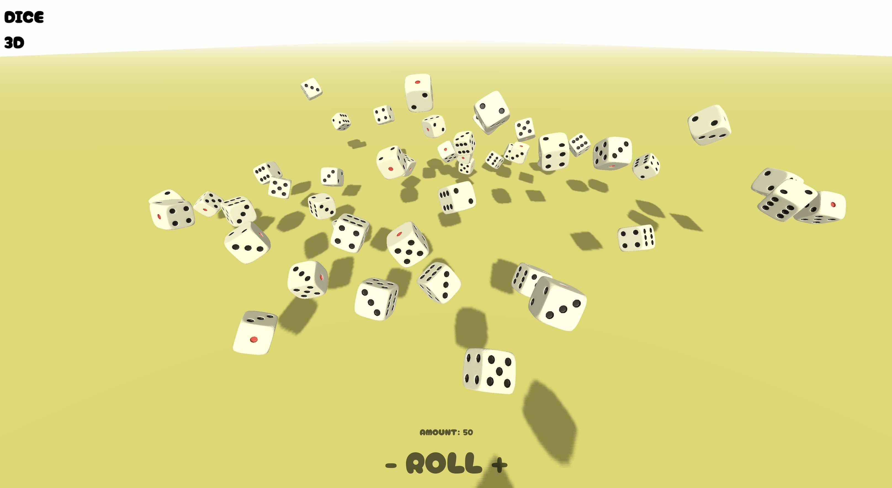

# DiceRollerSimulator-Three

[](https://github.com/BTI-US/DiceRollerSimulator-ThreeJS/actions/workflows/static.yml)
[](https://opensource.org/licenses/MIT)

- Last Modified: 2025-01-05
- Author: Phill Weston



A 3D dice simulator built on Three.js, utilizing Cannon.js as the physics engine, allowing users to control the number of the dices.

Now you can find a live version at [here](https://bti-us.github.io/DiceRollerSimulator-ThreeJS/).

## Features

- Built with Vite and Three.js: Ensures fast development and smooth performance for an immersive experience.
- Cannon.js Physics Engine: Provides realistic scene simulations for accurate dice interactions.
- Advanced Lighting and Shadow System: Creates beautifully rendered scenes with dynamic lighting effects.
- Variable Dice Quantity: Allows users to customize the number of dice, catering to diverse gameplay needs.
- Randomized Initial Dice Positioning: Enhances realism by randomizing starting positions, resulting in more authentic outcomes.
- Display Dice Roll Results: Shows the sum of the dice roll results, providing users with instant feedback.

## Installation

### Clone the repository

```shell
git clone https://github.com/BTI-US/DiceRollerSimulator-ThreeJS.git
```

### Install packages

```shell
npm i
```

### Start the app

```shell
npm run dev
```

## Environment Variables

|Variable Name|Description|Default Value|
|-|-|-|
|`VITE_VALIDATE_PROMOTION_CODE_API`|API endpoint to validate promotion code|`https://chubgame.com/wp-json/chubgame/v1/validate`|
|`VITE_SEND_DICE_DATA_API`|API endpoint to send dice data|`https://chubgame.com/wp-json/chubgame/v1/send`|
|`VITE_MAX_DICE_AMOUNT`|Maximum number of dice allowed|`10`|

## Milestone

- [x] Basic 3D dice simulator
- [x] Send the current dice number to the server using HTTP POST
- [x] Add the promotion code feature

## License

This project is licensed under the MIT License - see the [LICENSE](LICENSE) file for details.
