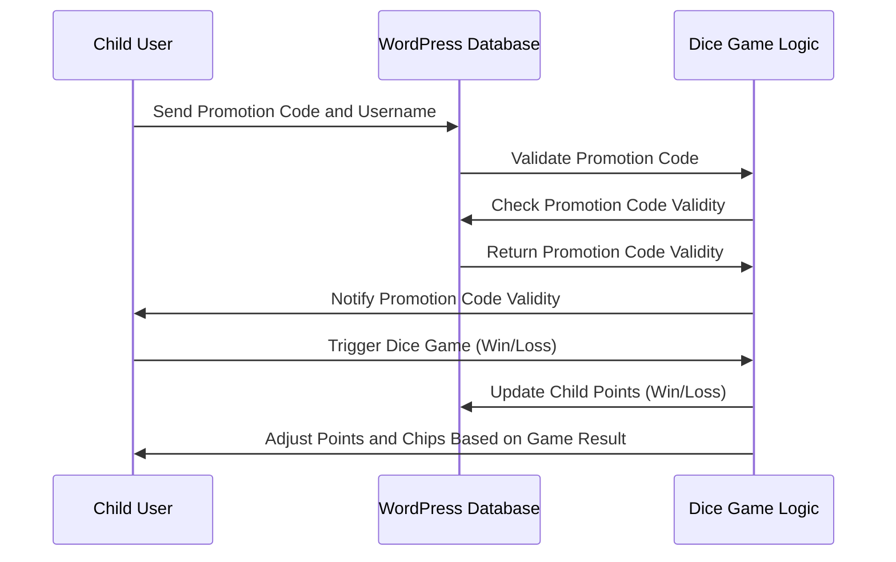
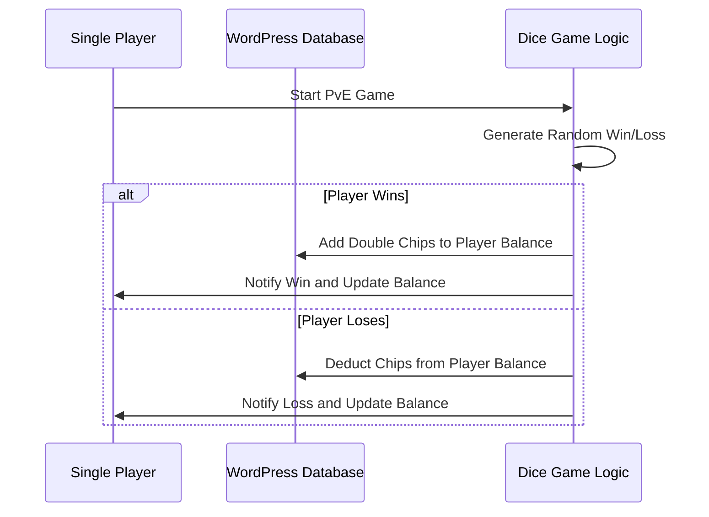
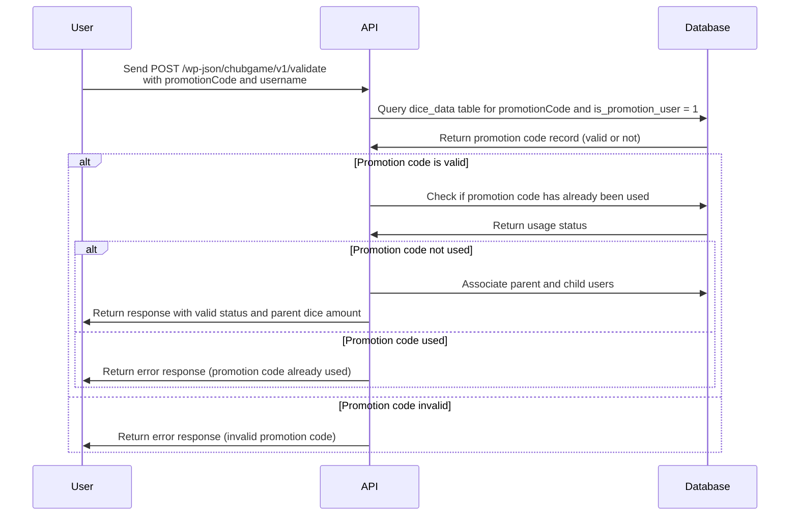
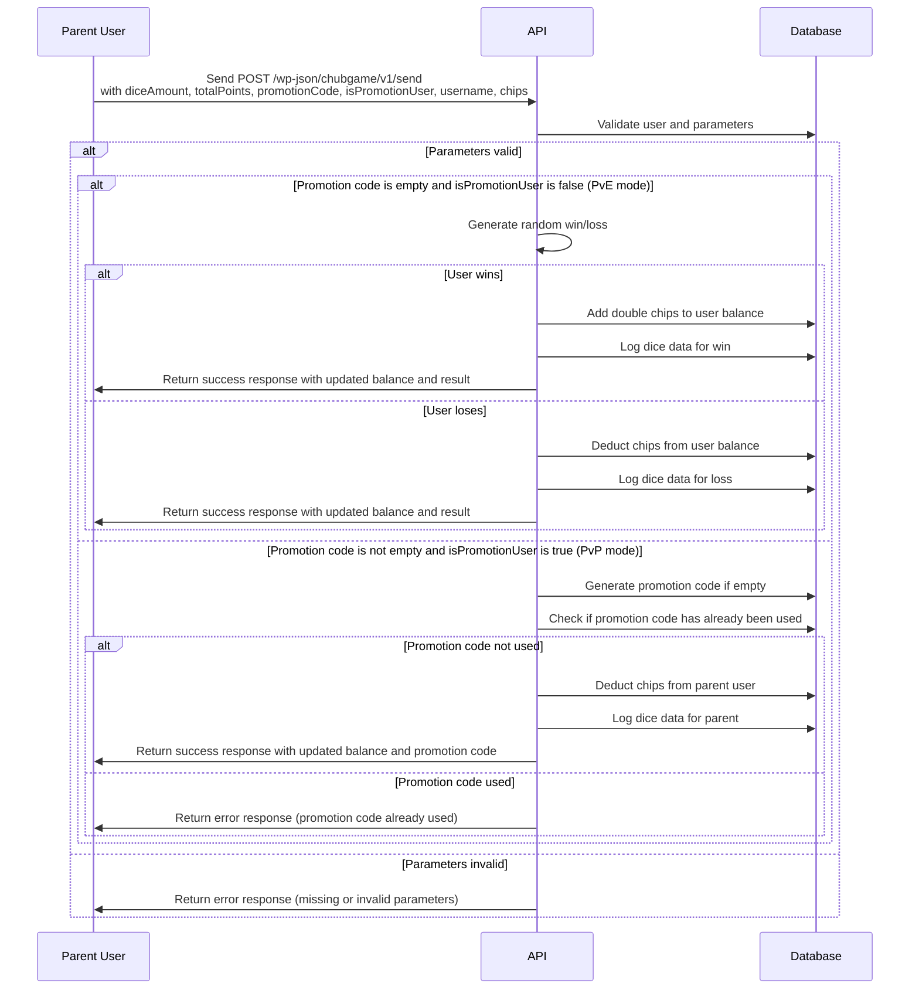
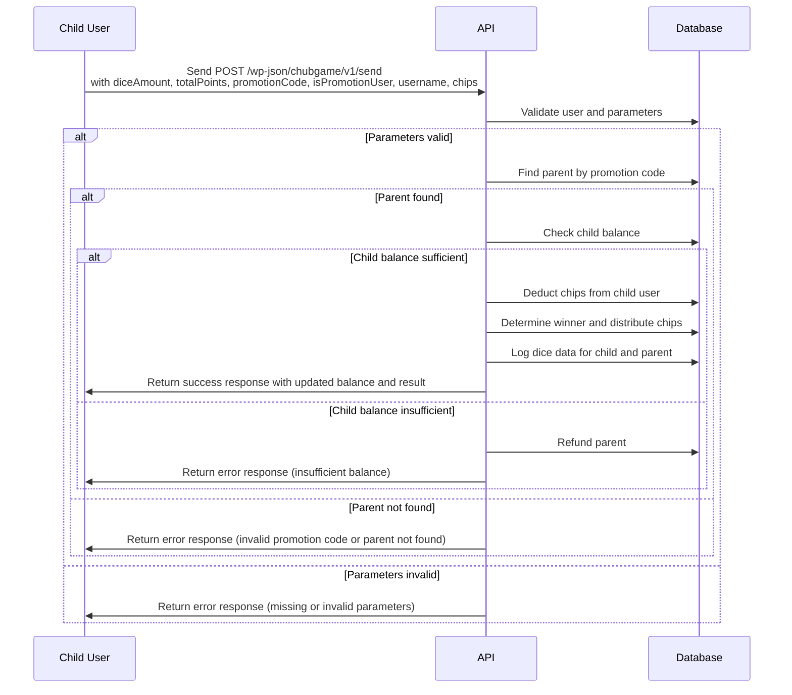
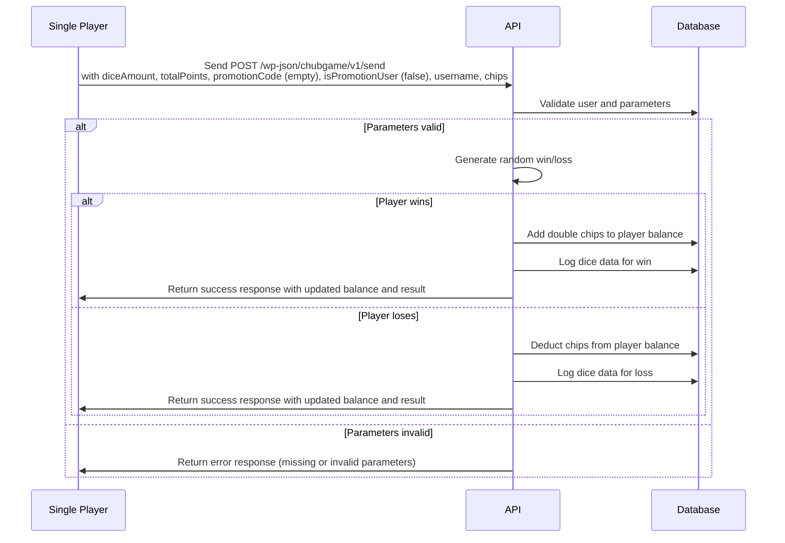

# DiceRoller-ChubGame

[](https://github.com/BTI-US/DiceRoller-ChubGame/actions/workflows/static.yml)
[](https://opensource.org/licenses/MIT)

- Last Modified: 2025-01-22
- Author: Phill Weston


A 3D dice simulator built on Three.js, utilizing Cannon.js as the physics engine, allowing users to control the number of the dices. This dice game is the first game developed by ChubGame.

Now you can find a live version at [here](https://dice.chubgame.com/).

## Features

- Built with Vite and Three.js: Ensures fast development and smooth performance for an immersive experience.
- Cannon.js Physics Engine: Provides realistic scene simulations for accurate dice interactions.
- Advanced Lighting and Shadow System: Creates beautifully rendered scenes with dynamic lighting effects.
- Variable Dice Quantity: Allows users to customize the number of dice, catering to diverse gameplay needs.
- Randomized Initial Dice Positioning: Enhances realism by randomizing starting positions, resulting in more authentic outcomes.
- Display Dice Roll Results: Shows the sum of the dice roll results, providing users with instant feedback.

## How to Play the Game

### Parent User

1. Connect to the wallet first.
2. After connecting, clicks the "Play Now" button of the Dice Game to start the game, then the game page will be popped up.
3. Click "Skip" button of the "Promotion Code" dialog to skip the promotion code. (Parent user doesn't need to input the promotion code)
4. Select the pre-defined chip amount or input the custom chip amount, then press the "Start" button to start the game.
5. Click "+" or "-" button to increase or decrease the number of dices, then press the "Roll" button to roll the dices, then the dices will be rolled, after the dices stop rolling, the total points will be displayed.
6. Click "Generate" button of the "Total Points" dialog to generate the promotion code, then the user data will be sent to the wordpress server. We will automatically deduct the chip amount from the parent user's wallet.
7. If the parent user's total dice points are greater than the child user, we will firstly deduct the 0.5% for the service charge, then the parent user will get both the parent user's and the child user's chip amount. Otherwise, the parent user will lose the chip amount.

### Child User

1. Connect to the wallet first.
2. After connecting, clicks the "Play Now" button of the Dice Game to start the game, then the game page will be popped up.
3. Input the promotion code, then press the "Submit" button to submit the promotion code.
4. Select the pre-defined chip amount or input the custom chip amount, then press the "Start" button to start the game.
5. Click "+" or "-" button to increase or decrease the number of dices, then press the "Roll" button to roll the dices, then the dices will be rolled, after the dices stop rolling, the total points will be displayed.
6. Click "Save" button of the "Total Points" dialog to save the user data to the wordpress server. We will automatically deduct the chip amount from the child user's wallet.
7. If the child user's total dice points are greater than the parent user, we will firstly deduct the 0.5% for the service charge, then the child user will get both the parent user's and the child user's chip amount. Otherwise, the child user will lose the chip amount.

## Installation

### Clone the repository

```shell
git clone https://github.com/BTI-US/DiceRoller-ChubGame.git
```

### Install packages

```shell
npm i
```

### Start the app

```shell
npm run dev
```

## Environment Variables

|Variable Name|Description|Default Value|
|-|-|-|
|`VITE_DEBUG_MODE`|Enable API debug mode|`true`|
|`VITE_VALIDATE_PROMOTION_CODE_API`|API endpoint to validate promotion code|`https://chubgame.com/wp-json/chubgame/v1/validate`|
|`VITE_SEND_DICE_DATA_API`|API endpoint to send dice data|`https://chubgame.com/wp-json/chubgame/v1/send`|
|`VITE_CHECK_BALANCE_API`|API Endpoint to check the user balance|`https://chubgame.com/wp-json/chubgame/v1/check-balance`|
|`VITE_MAX_DICE_AMOUNT`|Maximum number of dice allowed|`10`|
|`VITE_MAX_DICE_AMOUNT`|Maximum number of dice allowed|`10`|
|`VITE_MIN_CHIPS_AMOUNT`|Minimum number of chips allowed|`1`|
|`VITE_MAX_CHIPS_AMOUNT`|Maximum number of chips allowed|`100`|

## Game Logic

### Parent User Sequence Diagram


Child User Sequence Diagram:



PvE Single Player Sequence Diagram



## WordPress API Endpoints

### Flowchart for the Validate Promotion Code

Promotion Code Verification for Child User:



### Flowchart for the Send Dice Data

Parent User Sequence Diagram:



Child User Sequence Diagram:



PvE Single Player Sequence Diagram:



## Promotion Code Validation API

Validates a promotion code and associates the parent user with the promotion code.

### Endpoint

`POST /chubgame/v1/validate`

### Parameters

- `promotionCode` (string): The promotion code to validate.
- `username` (string): The username of the child user.

### Response

#### Success

```json
{
    "code": 200,
    "message": "Promotion code is valid and successfully applied.",
    "data": {
        "status": "success",
        "valid": true,
        "parent_user_id": 123,
        "parent_dice_amount": 5
    }
}
```

#### Error

```json
{
    "code": 400,
    "message": "Invalid promotion code",
    "data": {
        "status": "invalid_promotion_code"
    }
}
```

## Balance Validation API

Checks if the user has sufficient balance for the specified chips.

### Endpoint

`POST /chubgame/v1/check-balance`

### Parameters

- `username` (string): The username of the user.
- `chips` (int): The number of chips to check.

### Response

#### Success

```json
{
    "code": 200,
    "message": "Balance is sufficient for current user",
    "data": {
        "status": "success",
        "balance": 1000
    }
}
```

#### Error

```json
{
    "code": 400,
    "message": "Insufficient balance for parent user",
    "data": {
        "status": "insufficient_balance",
        "balance": 500
    }
}
```

## Dice Data and Manage Chips API

Handles the dice game data and manages the chips for parent and child users.

### Endpoint

`POST /chubgame/v1/send`

### Parameters

- `diceAmount` (int): The amount of dice rolled.
- `totalPoints` (int): The total points scored.
- `promotionCode` (string): Optional: The promotion code used, if empty, then the user is in the PvE mode.
- `isPromotionUser` (bool): Indicates if the user is a promotion user.
- `username` (string): The username of the user.
- `chips` (int): The number of chips of the current user.

### Response

#### Success

```json
{
    "code": 200,
    "message": "Game processed successfully",
    "data": {
        "status": "success",
        "balance": 1000,
        "result": 100,
        "promotion_code": "DEBUGCODE1234567"
    }
}
```

#### Error

```json
{
    "code": 400,
    "message": "This promotion code has already been used",
    "data": {
        "status": "promotion_used"
    }
}
```

## Milestone

- [x] Basic 3D dice simulator
- [x] Send the current dice number to the server using HTTP POST
- [x] Add the promotion code feature
- [x] Add the chip amount feature
- [x] Add the PvP and PvE mode

## License

This project is licensed under the MIT License - see the [LICENSE](LICENSE) file for details.
